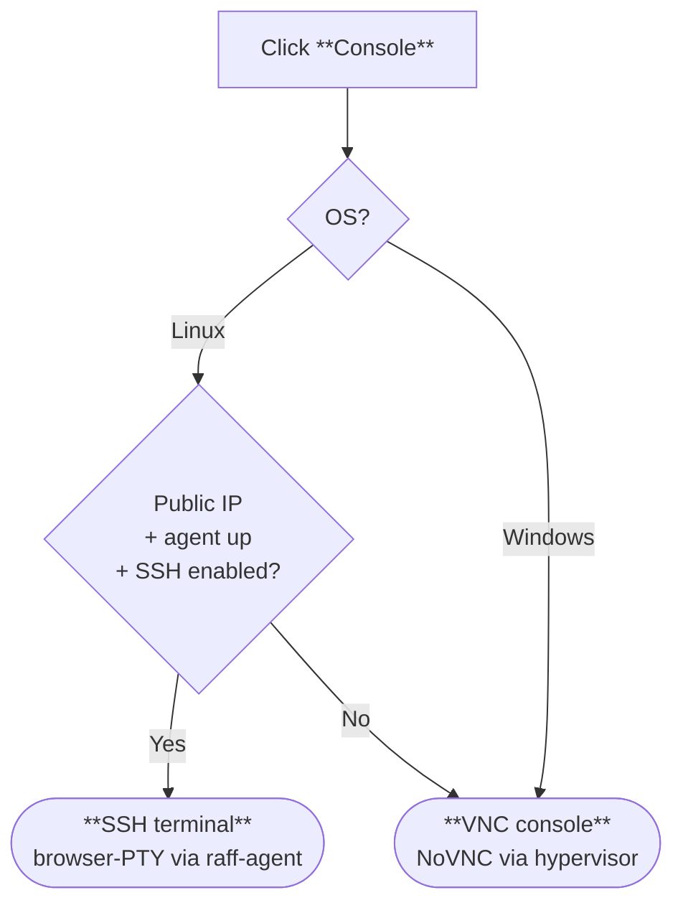

Updated May 8, 2026

The dashboard's **Console** button is one button with **two underlying technologies** behind it. The dashboard picks the right one for the OS and current state — you don't pick. Knowing which mode you're in matters because they have different capabilities (file transfer, copy/paste, keyboard chords, session lifetime), so this page is the dedicated explainer.

For the OS-specific access flows themselves — including the local-terminal SSH and RDP options — see [Connect via SSH](/products/build/virtual-machines/quickstart-guides/connect-via-ssh) (Linux) and [Connect via RDP](/products/build/virtual-machines/quickstart-guides/connect-via-rdp) (Windows). This page is just about the **in-browser** option.

## Two technologies, one button

| Mode | What's happening under the hood | When the dashboard picks it |
|---|---|---|
| **SSH terminal** (in-browser) | A PTY session is opened via `raff-agent` running inside the VM, proxied to your browser as a WebSocket. You're getting a real shell, end-to-end | **Linux VM** with a public IP and a healthy `raff-agent`. This is the default Linux Console experience |
| **VNC console** | A NoVNC client in your browser connects through the hypervisor to the VM's framebuffer. No network needed inside the guest, no agent needed | **Windows VM** (always — there's no SSH-terminal option for Windows). **Linux VM** when no public IP, agent down, SSH disabled. **Anytime you need to recover from a broken OS** regardless of OS |

The mode swap is automatic. The button label is the same — **Console** on the detail page, **Open Terminal** on the row Actions menu — but you can see which mode opened by what's on screen: a text shell with your prompt = SSH terminal; a graphical desktop / login screen = VNC console.

## The decision the dashboard makes

For Linux, the SSH terminal is preferred because it's lighter, supports clipboard, and behaves like every other terminal you're used to. VNC is the fallback for the cases where SSH-via-agent can't work. For Windows, there's no SSH-terminal option, so VNC is always what you get.

## SSH terminal — Linux primary (default)

When you click **Console** on a healthy Linux VM, the browser opens a fresh terminal tab pre-authenticated against the VM as `root` (or your sudo user). It looks like this:

<Frame>
  
</Frame>

What it is and isn't:

| Capability | Status |
|---|---|
| **Real shell** (bash / zsh / fish — whatever the VM has) | ✅ |
| **Full keyboard input**, including pipes / redirects / shell-quoting | ✅ |
| **Copy / paste** between host and VM via the browser's clipboard | ✅ |
| **Survives navigation** within the same session (until the tab closes) | ✅ |
| **File transfer** — `scp` / `sftp` / `rsync` directly from this terminal | ❌ Use [Transfer files](/products/build/virtual-machines/quickstart-guides/transfer-files) from your local terminal — the in-browser terminal can't reach your local filesystem |
| **Long-running attached sessions** — process keeps running if the tab closes | ❌ Wrap with `tmux` / `screen` / `nohup` if you need it |
| **Graphical apps** | ❌ Use VNC mode for X11 / GUI |

For local-terminal SSH (your own iTerm, Terminal, PuTTY, Windows OpenSSH), see [Connect via SSH](/products/build/virtual-machines/quickstart-guides/connect-via-ssh) — that's a separate option with its own advantages (local file access, persistent sessions, multiplexing).

## VNC console — Windows always, Linux fallback, universal recovery

When the dashboard opens VNC mode, you see the VM's actual screen — login prompt, desktop, BIOS, GRUB menu, BSOD, anything the framebuffer is rendering.

<Frame>
  
</Frame>

| Capability | Status |
|---|---|
| **Linux text mode** (getty / tty1 login) | ✅ — the default if you haven't installed a desktop environment |
| **Linux graphical** (X11 / Wayland) | ✅ — if you've installed GNOME / KDE / Xfce |
| **Windows graphical** | ✅ — login screen, desktop, everything |
| **Pre-OS access** (BIOS, GRUB, Windows boot menu) | ✅ — VNC attaches before the OS starts |
| **Survives broken networking inside the guest** | ✅ — connects through the hypervisor |
| **Survives `raff-agent` being down** | ✅ — VNC doesn't use the agent |
| **Special keys** (Ctrl-Alt-Del, Alt-Tab, F-keys, Sysrq) | Via the toolbar's special-keys menu — see below |
| **Clipboard** | Limited — paste-into-VM works in most browsers; copy-from-VM is browser-dependent |
| **File transfer** | ❌ Use [Transfer files](/products/build/virtual-machines/quickstart-guides/transfer-files) for SCP / SFTP / rsync once SSH is restored |

### Special keys

VNC sends keystrokes byte-for-byte, but the **browser intercepts** several useful chords for its own use (Ctrl-T opens a tab, F11 fullscreen, Alt-Tab switches host apps). Use the toolbar's **special-keys menu** to send those into the VM:

| Combo you need | Where to find it |
|---|---|
| **Ctrl-Alt-Del** (Windows lock screen, login, task manager) | Special-keys menu → **Ctrl-Alt-Delete** |
| **Alt-Tab** (Windows app switcher) | Special-keys menu |
| **F1–F12** (boot menus, Safe Mode trigger) | Direct works for most; if browser intercepts, use the menu |
| **Win key / Meta** | Special-keys menu |
| **Print Screen / Pause** | Special-keys menu |
| **Sysrq + key** (Linux magic SysRq) | Special-keys menu |

### Session lifetime — 1 hour

Each VNC session has a **fixed 1-hour TTL** from the moment you click Console. There's no idle-disconnect inside the hour and no auto-extend.

When the session expires, the canvas freezes / disconnects. The VM keeps running normally — only your viewer disconnected. **Close the tab and reopen Console** from the VM detail page to mint a fresh 1-hour session and reconnect to the same VM with no state loss.

For long debugging or recovery sessions, plan to reconnect every hour. The SSH terminal mode doesn't have this limit — if you're working on Linux and don't specifically need VNC, prefer the SSH terminal for marathon sessions.

## Open the Console

The same Console action opens in three places — they're equivalent:

<Frame>
  
</Frame>

<Frame>
  
</Frame>

| Path | Where |
|---|---|
| **VM detail page → Console button** | Top action bar, orange |
| **Compute (Instances list) → row's `⋮` → Open Terminal** | Per-VM Actions menu |
| **VM detail → Actions tab** | Same Console action, just on a tab if you've scrolled past the top |

The dashboard generates a one-time session token, opens a new browser tab pointed at the right protocol (SSH WebSocket or NoVNC), and authenticates you transparently. You don't enter the VM password manually — the session is already authorized.

## When to deliberately reach for VNC over SSH

Even for a healthy Linux VM where the dashboard would pick SSH terminal by default, there are situations where you specifically want VNC:

| Situation | Why VNC, not SSH terminal |
|---|---|
| You're about to **change the firewall, sshd config, or networking** | If the change locks you out, VNC is unaffected. SSH terminal would die mid-edit |
| You're rebooting the VM and want to **watch it boot** | VNC sees the BIOS / GRUB / login. SSH terminal disconnects on reboot |
| You're **booting into single-user mode / GRUB recovery** | The boot menu only shows in VNC; SSH terminal connects post-login |
| You need **graphical Linux apps** (`xterm`, browser, IDE) | SSH terminal is text-only |
| You're recovering from a **broken `raff-agent`** | SSH terminal needs the agent; VNC bypasses it |

To force VNC mode on a Linux VM where SSH would otherwise work, the simplest path is to temporarily stop the agent inside the VM (`systemctl stop raff-agent`) — the next Console click will fall back to VNC. Re-enable when you're done.

## Recovery path — the universal fallback

VNC is the **always-works** connection method for any locked-out scenario:

- **Linux** — SSH config broken, firewall locked you out, disk full, single-user mode → see [Recover a locked-out VM § Linux](/products/build/virtual-machines/quickstart-guides/recover-locked-vm)
- **Windows** — Safe Mode, WinRE, password recovery → see [Recover a locked-out VM § Windows](/products/build/virtual-machines/quickstart-guides/recover-locked-vm#4-windows-recovery--safe-mode-winre-and-ctrl-alt-del)

When the in-browser SSH terminal fails to open (agent down, network broken, OS panicked), the dashboard automatically falls back to VNC. You don't have to do anything different — click Console and you'll get the right viewer.

## Common questions

<AccordionGroup>
  <Accordion title="How do I tell which mode opened?">
    Look at the screen. **Text shell with a prompt** = SSH terminal. **Graphical login or desktop, or text-mode getty (with `login:` prompt)** = VNC console. The two also have different toolbars: SSH terminal has clipboard / paste controls; VNC has the special-keys menu and disconnect button.
  </Accordion>

  <Accordion title="Can I copy / paste between my laptop and the VM?">
    **SSH terminal** — copy and paste work normally via your browser's clipboard. **VNC console** — paste-into-VM works via the toolbar's clipboard tool (most browsers prompt for permission once); copy-out is browser-dependent and limited. For real data transfer either way, use [Transfer files](/products/build/virtual-machines/quickstart-guides/transfer-files).
  </Accordion>

  <Accordion title="Can two people open the console on the same VM at the same time?">
    For VNC, no — the underlying VNC session is single-attach; the second connection bumps the first. For SSH terminal, multiple parallel sessions are fine. Coordinate via chat before two of you click Console.
  </Accordion>

  <Accordion title="Why does my Windows VM only show VNC?">
    Windows doesn't ship with a native SSH server (and Raff doesn't run an SSH-terminal-compatible agent on Windows VMs by default). For Windows graphical access, VNC and RDP are the two options — see [Connect via RDP](/products/build/virtual-machines/quickstart-guides/connect-via-rdp) for the local-client RDP path.
  </Accordion>

  <Accordion title="The VNC session expired mid-recovery. Did I lose my work?">
    No — the **VM kept running** uninterrupted. Only your VNC viewer disconnected. Close the tab and click Console again from the VM detail page to get a fresh 1-hour session and reconnect to wherever the VM is now. If you were editing a file, it's still in whatever editor you had open inside the VM.
  </Accordion>

  <Accordion title="Why is the VNC console laggy?">
    Latency is bounded by your network round-trip to the hypervisor + the VM's framebuffer-update rate. Tips:
    - Use **SSH terminal** for everyday Linux work — VNC is for graphical / recovery cases
    - Stay in **text mode** for Linux work in VNC — graphical desktops repaint a lot
    - Close other tabs talking to Raff — they share rate limits and bandwidth
    - For Windows, pure RDP from a local client outperforms VNC for sustained graphical work — VNC is best for getting in when RDP is broken
  </Accordion>
</AccordionGroup>

## Related

<CardGroup cols={3}>
  <Card title="Connect via SSH" icon="terminal" href="/products/build/virtual-machines/quickstart-guides/connect-via-ssh">
    Linux access — including the in-browser terminal and your own local SSH client.
  </Card>
  <Card title="Connect via RDP" icon="display" href="/products/build/virtual-machines/quickstart-guides/connect-via-rdp">
    Windows graphical desktop via RDP from a local client.
  </Card>
  <Card title="Recover a locked-out VM" icon="life-ring" href="/products/build/virtual-machines/quickstart-guides/recover-locked-vm">
    Use the VNC console as the universal recovery path — Linux GRUB / Windows Safe Mode.
  </Card>
</CardGroup>
