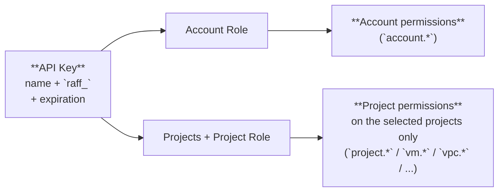
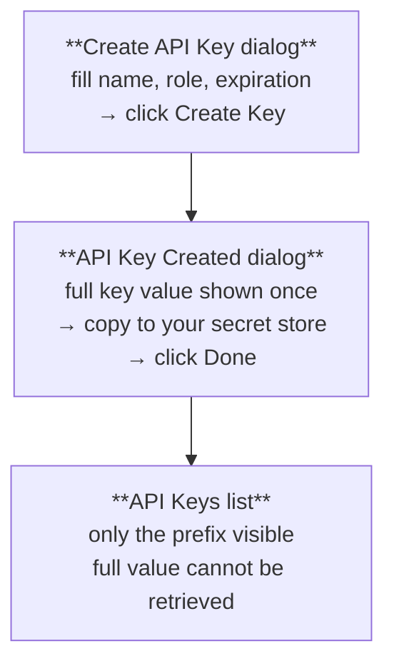

This is the model page for **API keys** — what they are, how they get their permissions, what their lifecycle looks like, and the security practices that follow from the design. The Roles model itself is on [Roles, scopes, and the Owner](/products/manage/team-access/concepts/roles-and-api-keys); this page focuses on the key-specific parts.

## What an API key is

An API key is a **long random secret token** that authenticates a non-interactive client (a script, a CI pipeline, Terraform, a backend service) against the Raff API. Format:

```
raff_17d70fcf7e7510968a4c19279b25707f088f1cc5ad8b74210341d8e470b5bb7a
```

- **`raff_`** prefix — distinctive, easy to grep for in code reviews and to detect via tools like GitGuardian or `truffleHog`
- A long opaque suffix — the secret part. Treat it like a password
- Sent in every authenticated request as the **`X-API-Key`** header

Keys are tied to your **account** (not to a specific user) and carry a **frozen role assignment** — see below.

## How a key gets its permissions

Every key carries an Account Role + (optionally) a Project Role applied to one or more projects:



In plain words:

| The key carries | Which determines |
|---|---|
| **Account Role** (one — required) | The key's `account.*` permissions (members, billing, audit, project list, role catalog) |
| **Projects + Project Role** (zero or more projects, one role applied to all of them — optional, hidden when Account Role is Owner) | The key's `project.*` / `vm.*` / `vpc.*` / etc. permissions on **those projects only** |
| **Expiration** | When the key auto-revokes |

Three points worth highlighting:

1. **Same role catalog as members.** The Account Role / Project Role dropdowns in Create API Key list the exact same System and Custom roles you assign to members. There's no "key-only" permission set.
2. **Owner = full access, no project selection needed.** When the Account Role is Owner, the key has Owner-level access to every project, current and future. The Project Role / projects fields are hidden in the create dialog.
3. **One Project Role applied uniformly.** When the Account Role is anything other than Owner, you pick one or more projects and a single Project Role; that role applies the same way on all selected projects. To give a key different roles on different projects, create one key per role.

## Frozen role, mutable role definition

A key carries a **reference to a role** (e.g. `Operator` for project access on `customer1`) — not a snapshot of permissions. This has an important consequence:

- **Editing the role definition** affects every key (and member) using that role. Add `vm.console` to your Custom `CI Operator` role, and every key with that role gains `vm.console` access on next request.
- **Editing the key directly** is **not supported** — there's no "change role on this key" action. The fix is to **rotate the key (Regenerate)** if you want a fresh key value, or **delete and recreate** if you want a different role assignment.

This is the centralized role system in action. Roles are the single source of truth; keys and members reference them. Change one role, every grant using it changes.

## The create-once / show-once secret lifecycle

The full key value is **shown exactly once** — in the **API Key Created** dialog right after you click Create. After that, only the prefix (`raff_17d70fcf…`) is visible on the dashboard's API Keys list.



This is intentional: Raff stores only a hash of the key value, not the value itself, so even Raff staff can't show it back to you. If you lose the key value, the only path forward is to **rotate** (Regenerate) — that issues a new value and invalidates the old.

## Expiration

Every key has an expiration — either **Never** or one of the bounded presets (30 / 60 / 90 / 120 / 180 days, 1 year). The expiration is set at create time and is **immutable**:

- An expired key authenticates with `401 Unauthorized` and is unusable until rotated.
- Rotation issues a fresh key value with the **same** expiration setting calculated from the rotation timestamp (a key originally set to "1 year" gets another full year on rotation; a key set to "Never expires" keeps that property).
- To change a key's expiration model (e.g. from "1 year" to "Never" or vice versa), **delete and recreate** with the new setting.

The default is **Never expires**, but bounded expirations are strongly recommended for production keys. A key that auto-expires after 90 days forces you to rotate; a "Never expires" key tends to outlive the integration that uses it and end up forgotten in some forgotten secret store.

## Lifecycle states

A key passes through a small set of states:

| State | Reached by | Effect |
|---|---|---|
| **Active** | Successful Create | Authenticates requests; permissions taken from current role definitions |
| **Expired** | Reaching its expiration timestamp | Returns `401`; key remains in the list with `Expires: Expired` until you delete or rotate |
| **Rotated** | Clicking Regenerate | Old value invalid immediately; new value issued. Same `Active` state, just a different secret |
| **Deleted** | Clicking the red trash icon, or via API | Authentication fails immediately; key disappears from list. Audit-log entries referencing the key remain |

There's no "disabled but not deleted" state today — to stop a key from authenticating without losing its audit trail, deletion is the only path; the audit-log entries are preserved separately.

## Authentication, briefly

Every authenticated API request includes:

```
X-API-Key: raff_<your-key-suffix>
```

Project-scoped requests (anything that lists or creates a resource in a project) **also** include:

```
X-Project-ID: <project-uuid-the-key-has-access-to>
```

The combination determines which permission set applies to the request — Account permissions for account-only endpoints, Project permissions for resource endpoints. See [Authentication](/authentication) for the full request reference, sample SDK setup, and 401/403 troubleshooting.

## One key per integration

The right granularity for keys: **one key per integration, named for what it does**. Examples:

- `Production CI` — the key your CI pipeline uses to deploy
- `Backups Lambda` — the key your scheduled backup script uses
- `Terraform — staging` — the key your IaC uses against the staging project
- `Datadog Sync` — the key your observability vendor uses to read VM metadata

This pattern makes:

- **Rotation cheap** — when one integration is compromised or being decommissioned, you rotate / delete just its key
- **Audit logs readable** — `apikey.id = abc123 (Backups Lambda)` is more useful than `apikey.id = abc123` and grepping
- **Scope tight** — each key gets exactly the permissions its integration needs, nothing more

The opposite anti-pattern — one shared "master key" used by every integration — turns a compromise of any single system into a full account compromise, makes rotation a multi-deploy headache, and makes the audit log nearly useless.

## Security practices

A short list of practices that make API-key security boring (which is the goal):

| Practice | Why |
|---|---|
| **Use bounded expirations** (30 / 90 / 180 days) for production keys | Forces rotation; auto-revokes forgotten keys |
| **Use System or Custom roles narrower than Owner** for any key that doesn't need full access | Limits the blast radius of a leak |
| **Never commit a key value** to source control. Use environment variables and a secret manager (1Password, AWS Secrets Manager, GitHub Actions secrets, Vault) | Prevents the most common leak path |
| **One key per integration**, named for the integration | Cheap rotation, useful audit logs |
| **Rotate on suspicion**, not just on policy | When a key may be compromised, rotate first and investigate after |
| **Watch `Last Used` for keys you don't recognize** | A key that's never been used or hasn't been used in months may be a forgotten attack surface — delete it |
| **Use the audit log** to track who created which key, who rotated, who deleted | `account.audit.view` permission required |

Raff's `raff_` prefix is also designed to make accidental commits **detectable**: GitGuardian, `truffleHog`, and similar secret-scanners pick it up out of the box. If you push a key by mistake, the scanner will flag it within minutes — rotate immediately and review the commit.

## What you cannot do today

- **Edit a key's permissions after create** — change the underlying role, or rotate to a different key
- **Assign different Project Roles to different projects in one key** — create separate keys
- **Recover the full key after the create dialog closes** — only the prefix is preserved
- **Extend a key's life past its current expiration** — rotate to refresh, or delete and recreate
- **Disable a key without deleting it** — deletion is the only "stop" mechanism

## Related

<CardGroup cols={3}>
  <Card title="Generate an API key" icon="key" href="/products/manage/team-access/quickstart-guides/generate-api-key">
    Walk the create flow.
  </Card>
  <Card title="Rotate an API key" icon="arrows-rotate" href="/products/manage/team-access/quickstart-guides/rotate-api-key">
    Replace a leaked or aging key.
  </Card>
  <Card title="Authentication" icon="code" href="/authentication">
    How keys authenticate against the API.
  </Card>
</CardGroup>
