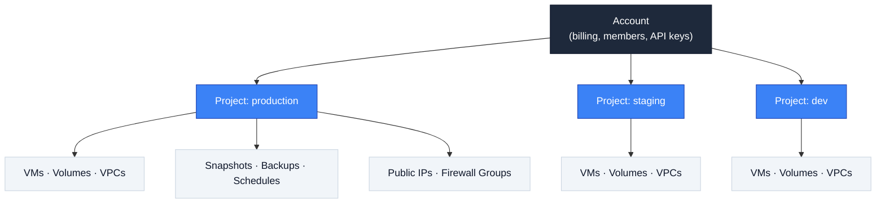

<sub>Updated May 8, 2026</sub>

A **project** is a scope boundary for resources. Every resource (VM, volume, snapshot, backup, backup schedule) belongs to exactly one project. The project doesn't change what a resource is or what it costs — it just determines how it's grouped, listed, and accessed.

## The model at a glance



The account is the **billing and identity boundary** — members, API keys, payment method, and balance all live there. Projects are **resource buckets inside the account** — pick one for every list/create call to scope what you see and what you touch.

## How scoping works

- **List endpoints** — `X-Project-ID` is **optional**. Set it to scope the list to one project. Omit it to list across **every project the API key has access to**.
- **Mutating endpoints** (create, delete, power actions, resize, attach/detach) — `X-Project-ID` is **required**. The header tells the platform which project the new or modified resource belongs to.
- **Get-by-ID endpoints** — `X-Project-ID` is **not taken**. The resource is found by its UUID alone, regardless of which project it lives in.

## What lives inside a project

| Resource | In a project? |
|---|---|
| Virtual Machines | Yes |
| Volumes | Yes |
| Snapshots | Yes |
| Backups | Yes |
| Backup schedules | Yes |
| VPCs, Public IPs, Firewall | Yes |
| API keys, members, billing | No — account level |

## API example — `X-Project-ID` in practice

Every list and create call against project-scoped resources takes the project as a header. The API key goes in `X-API-Key`; the project context goes in `X-Project-ID`.

**1. Get your project IDs:**

```bash
curl -X GET https://api.rafftechnologies.com/api/v1/projects \
  -H "X-API-Key: $RAFF_API_KEY"
```

Response (truncated):

```json
{
  "data": [
    {
      "id": "prj_01HXK5Q2J3P4N5R6T7V8W9Y0Z1",
      "name": "production",
      "description": "Production workloads"
    },
    {
      "id": "prj_01HXK5Q2J3P4N5R6T7V8W9Y0Z2",
      "name": "staging",
      "description": "Pre-prod environment"
    }
  ]
}
```

**2. List VMs in the `production` project:**

```bash
curl -X GET https://api.rafftechnologies.com/api/v1/vms \
  -H "X-API-Key: $RAFF_API_KEY" \
  -H "X-Project-ID: prj_01HXK5Q2J3P4N5R6T7V8W9Y0Z1"
```

Only VMs that belong to `production` come back. Run the same call against the `staging` project ID and you get a completely different list — same account, different scope.

**3. Create a VM in the `staging` project:**

```bash
curl -X POST https://api.rafftechnologies.com/api/v1/vms \
  -H "X-API-Key: $RAFF_API_KEY" \
  -H "X-Project-ID: prj_01HXK5Q2J3P4N5R6T7V8W9Y0Z2" \
  -H "Content-Type: application/json" \
  -d '{
    "name": "api-staging-01",
    "template_id": "tmpl_01HXJ...",
    "pricing_plan_id": "plan_01HXJ..."
  }'
```

The new VM is created **inside `staging`**. It will show up in `GET /api/v1/vms` only when that same `X-Project-ID` is set.

**Common mistakes:**

- **Forgetting the header on a create/delete call** — mutating endpoints reject the request with a 400 if `X-Project-ID` is missing. Always include it on POST/DELETE/PATCH.
- **Assuming a list call needs the header** — it doesn't. Omitting `X-Project-ID` on `GET /api/v1/vms` returns every VM across every project the API key has access to; useful for fleet-wide audits, surprising if you expected an empty list.
- **Cross-project create with the wrong header** — if your API key only has access to `production` but you set `X-Project-ID: <staging-id>`, the create is rejected with a 403. The header's project must be one the API key can actually reach.

## Patterns

- **One project per environment** — `production`, `staging`, `dev`. Standard pattern.
- **One project per team** — when teams own non-overlapping infra. Combines well with role-based access.
- **One project per customer** — for accounts that resell or operate multi-tenant infra.

## Related

<CardGroup cols={2}>
  <Card title="Create a project" icon="plus" href="/products/manage/team-projects/quickstart-guides/create-a-project">
    Set one up.
  </Card>
  <Card title="Authentication" icon="key" href="/authentication">
    How `X-Project-ID` works in the API.
  </Card>
</CardGroup>
