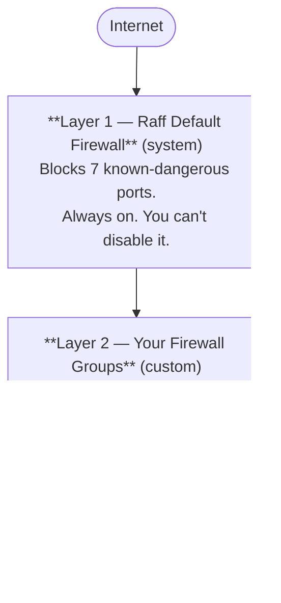

Updated May 6, 2026

This is the one page to read before you build a Firewall Group. It's the model — what the layers are, how a rule is shaped, what protocols and port formats the system accepts, and which ports are off-limits no matter what you write.

## Two layers, both always on

Every packet that arrives at or leaves your VM's **public** interface goes through two filters:

**Both layers must allow the packet** — the Default doesn't override your group, and your group doesn't override the Default. If either one drops the packet, it's gone.

This means even if you write a "Allow All TCP" rule in your group, **TCP 135 / 139 / 445 / 5985 / 5986 stay blocked** — the Default keeps blocking them and Raff actively *removes* those ports from any range you submit. That's the system protecting you from a class of well-known Windows-network exploits.

**Traffic on a VM's VPC interface is not filtered by either layer.** Firewall Groups only apply to public network traffic. For VPC-to-VPC isolation, see [VXLAN, CIDR, and isolation](/products/network/vpc/concepts/cidr-and-isolation).

## What the Default Firewall blocks

The system Default has these inbound denies (visible by clicking **View Rules** on the Default card):

<Frame>
  
</Frame>

| Protocol | Port(s) | Service | Why it's blocked |
|---|---|---|---|
| TCP | 135 | MS-RPC | Remote code execution risk |
| TCP | 139 | NetBIOS Session | Network file-sharing exploit vector |
| TCP | 445 | SMB | Ransomware vector (WannaCry / EternalBlue) |
| TCP | 5985–5986 | WinRM | Remote management exploit vector |
| UDP | 137–138 | NetBIOS | Network discovery exploit |

Everything else inbound is **allowed by default**, and **all outbound is unrestricted**. ICMP (ping) is also allowed inbound by default.

If you want to lock the VM down further (e.g. only allow SSH inbound from your office IP, deny everything else), that's exactly what your own Firewall Groups are for.

## What a single rule looks like

A rule has six fields. The dashboard's create-rule row shows three of them; the other three are populated automatically or are optional.

| Field | Required | Values | What it means |
|---|---|---|---|
| **Protocol** | Yes | `TCP`, `UDP`, `ICMP`, `ALL` | The IP protocol the rule matches |
| **Direction** | Yes | `INBOUND` or `OUTBOUND` | Set by which list you put the rule in (the create dialog has separate Inbound and Outbound sections) |
| **Range** (port spec) | Required for TCP/UDP | `22`, `80,443`, `3000:4000`, or empty for `ALL` | The port(s) the rule matches. Format options below |
| **IP / Size** (source/dest) | Optional | `0.0.0.0/0`, `192.168.1.100/32`, etc. | The remote address(es) the rule allows. Defaults to "any" |
| **Network ID** (VPC scope) | Optional | A VPC ID | Limits the rule to traffic from a specific VPC. Rare; mostly used by the Database template |
| **ICMP Type** | Optional, ICMP only | `8` for ping, etc. | Specific ICMP packet type |

## Port format — what Raff accepts in `Range`

The **Ports** field on the create dialog accepts these forms:

| Format | Means | Example |
|---|---|---|
| **Single port** | One port | `22` (just SSH) |
| **Comma-separated list** | Several discrete ports | `80,443` (HTTP and HTTPS) — `22,80,443,3306` |
| **Colon-separated range** | Inclusive range | `3000:4000` (every port from 3000 to 4000) |
| **Empty** | All ports for the chosen protocol | Leave blank when Protocol is `ALL` or you want every port for TCP/UDP |

Mixing list and range in one field — `80,443,3000:4000` — also works.

A few rules:

- Each "rule row" you add in the dialog is **one rule**. If you need both single ports and a range, add them as separate rows or combine them in one `Range` value with commas.
- For `Protocol = ICMP`, the **Range** field is replaced by an optional **ICMP Type** (e.g. `8` for echo request / ping). Most people just leave Protocol on ICMP with no type for "all ICMP."
- For `Protocol = ALL`, the **Range** is ignored — `ALL` matches every protocol and every port.

## Source / destination IP format

The third box on each rule row (next to the port box) is the **source IP** for inbound rules or **destination IP** for outbound rules.

| Format | Means |
|---|---|
| `0.0.0.0/0` *(default)* | Any IPv4 — labeled `Any` in the dialog |
| `192.168.1.100/32` | A single IPv4 address |
| `203.0.113.0/24` | A whole /24 subnet (256 addresses) |
| `10.0.0.0/8` | A whole /8 (16 million addresses) |
| `2001:db8::/32` | An IPv6 prefix |

Internally Raff splits this into two fields — the bare IP and a SIZE (number of addresses), with `0.0.0.0` + `size 0` meaning "any". You don't see this split in the dashboard; you just type CIDR.

The "Any" placeholder you see in the create dialog is `0.0.0.0/0`. Leave it as-is to allow from anywhere; replace it to lock down to specific source IPs (your office's public IP, a partner's egress range, an allowlist of known clients).

## Stateful — what that means

Raff's firewall is **stateful**. That has one practical implication everyone needs to know:

> When you allow an inbound connection to port 80, you do **not** also need an outbound rule to allow the response to leave on port 80. The firewall remembers the connection and lets the reply through automatically.

The same applies in reverse — if your VM initiates an outbound connection to `1.1.1.1:53` (DNS), the response from `1.1.1.1:53` is allowed back even without an explicit inbound rule.

This is why most workloads only need inbound rules — outbound is "all open" out of the box, and replies on existing connections are tracked automatically.

## How rules combine

Within **one Firewall Group**, rules are **additive (OR-of-allows)**:

- An inbound rule says *"allow this protocol+port+source"*. Multiple inbound rules combine — a packet matches if **any** rule allows it.
- The same applies to outbound.
- There are no explicit deny rules in user groups; **deny is the default**, and you write allow rules to open holes. Anything not matched by an allow rule is dropped.

When **multiple Firewall Groups** are attached to the same IP (rare; typically one per IP), their allow lists union.

The Default Firewall's blocks **always win** — even if your group says "Allow TCP 135", the system Default still drops packets to TCP 135. Raff also pre-emptively rewrites your rule before saving to remove blocked ports from a range — a rule of `Range = 130:200` becomes `130:134,136:138,140:200` (135 and 139 carved out), so the saved rule is honest about what's actually allowed.

## The 5 templates

The create dialog's **Start from template** dropdown pre-fills the Inbound and Outbound rules. You can pick one and tweak before saving, or start blank.

| Template | Inbound | Outbound | Use when |
|---|---|---|---|
| **Web Server** | TCP 22 (SSH), TCP 80,443 (HTTP/HTTPS), ICMP | All | Public websites — needs SSH for admin and HTTP/HTTPS for traffic |
| **Database Server** | TCP 22 (SSH), TCP 3306,5432 (MySQL/Postgres) — *VPC-scoped* | All | DB behind a private network; SSH from anywhere, DB only from VPC |
| **SSH Only** | TCP 22 | All | Bastion hosts, locked-down workers |
| **Allow All** | All inbound | All outbound | **Not recommended for production** — useful for development and debugging |
| **Deny All** | (none) | (none) | Lockdown — VM is reachable only via direct console / VNC |

The Database Server template is the only one that scopes its DB rules to a VPC by default — it sets `NetworkID` so the rule only matches traffic coming from VMs in the same VPC. The dashboard fills the right VPC ID at creation time.

## Layered with the public-IP firewall slot

A **Firewall Group is attached to a public IP**, not to the VM directly. The flow is:

1. You create a Firewall Group with rules
2. On the VM's detail page → Network tab → public IP card → click **Attach** firewall, pick the group
3. The group now applies to that IP's public traffic

If a VM has two public IPs (one IPv4 + one IPv6 for example), each IP gets its own firewall slot and you can attach a different group to each. If a VM has no public IP, there's nothing to attach to — VPC-only VMs aren't covered by Firewall Groups.

## What this means for VMs without a public IP

A VM without a public IP only has VPC interfaces. Firewall Groups don't apply to VPC traffic — that's by design. To control private traffic between VMs, the levers are:

- The **VPC itself** (VXLAN-isolated; nothing outside the VPC can reach in)
- **Guest-OS firewalls** (`ufw`, `iptables`, Windows Firewall) on the destination VM
- A **Firewall Appliance** (OPNsense) deployed as the VPC's gateway — see [Manage a VPC → Firewall Appliance](/products/network/vpc/quickstart-guides/manage-vpc#firewall-appliance-499-or-999--month)

Raff Firewall Groups (this product) are specifically a **public-internet** filter, layered between the world and the VM's public IP.

## Related

<CardGroup cols={3}>
  <Card title="Create a Firewall Group" icon="plus" href="/products/network/firewall/quickstart-guides/create-firewall-group">
    Walk the create dialog.
  </Card>
  <Card title="Add rules" icon="list" href="/products/network/firewall/quickstart-guides/add-rules">
    Port and IP formats by example.
  </Card>
  <Card title="Features & limits" icon="circle-info" href="/products/network/firewall/details/features-and-limits">
    The full table — 40 inbound + 40 outbound, 5 templates, blocked ports.
  </Card>
</CardGroup>
