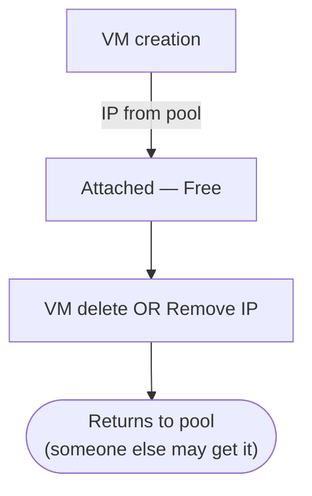
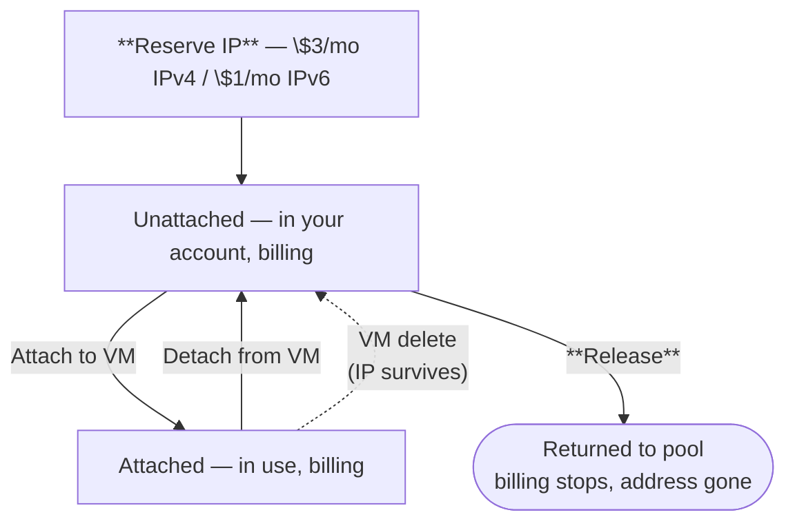

Updated May 6, 2026

Raff has two distinct lifecycles for a public IP. The dashboard, the API, and the billing system all treat them as different first-class objects — choose the wrong one and you'll either pay too much for an address you don't need to keep stable, or lose an address you wanted to preserve.

This page is the side-by-side reference. Most of what's here is repeated in the quickstart guides; the difference is that this page is just the model, no walkthrough.

## The two lifecycles

| | **Auto-assigned** | **Reserved** |
|---|---|---|
| **Allocated from** | Regional pool | Reserved out of the pool, held in your account |
| **Cost while attached** | **Free** | **\$3 / month** |
| **Cost while unattached** | N/A — auto-assigned IPs are always attached | **\$3 / month** (continues) |
| **What "detach" does** | Returns the address to the pool. Anyone may get it next | Removes the IP from the VM but keeps it in your account, ready to re-attach |
| **What VM delete does** | Releases the IP back to the pool with the VM | IP survives — stays in your account |
| **Movable between VMs?** | No (each detach gets a different address from the pool) | **Yes** — detach + re-attach keeps the same address |
| **Stable across VM rebuild?** | No | **Yes** |
| **Eligible for DNS / partner whitelisting?** | Risky — you might lose it on any detach | **Yes** — that's the whole point |
| **API type field** | `auto_assigned` | `reserved` |
| **Surfaced in dashboard as** | "Public" tag on the VM's Network tab | "Reserved" tag, shown on Public IPs tab + VM Network tab |

The simplest way to remember it: **auto-assigned = the VM owns it, reserved = your account owns it**.

## Why two lifecycles exist

Cloud providers used to give every VM "a public IP" and called it a day. The problem is that two very different needs were sharing one mechanism:

- **The "I just want this VM on the internet" need** — short-lived, replaceable, no commitment. Free is good. Whatever IP you got is fine.
- **The "I have published this IP somewhere I can't easily change" need** — DNS records, customer firewalls, certificate-pinned clients, partner whitelists. The address is a *contract*. It can't change without coordinated work.

Mixing the two in one bucket means either:

- **Charging for everything** so the addresses survive (everyone pays even though most don't care), or
- **Releasing on detach** so the free path works (and breaking everyone who cared about stability)

Splitting them — auto-assign for transient, reserve for stable — lets each get the right behavior. You only pay \$3/month when you opt into stability; everyone else gets free public IPs without a meter.

## The lifecycle, picture by picture

### Auto-assigned

Detaching is terminal — the IP doesn't come back to your account. If you re-add a public IP to the same VM later, you get a different address.

### Reserved

The IP stays yours through every state except after Release. Billing runs continuously through every state except after Release.

## When to pick which

| Workload | Pick |
|---|---|
| New VM, not in DNS yet, no external dependency on the address | **Auto-assigned** |
| Test environment, frequently rebuilt, no contract on the address | **Auto-assigned** |
| VM behind a load balancer or reverse proxy where the IP is internal-only | **Auto-assigned** |
| Production web server with an `A` record pointing at it | **Reserved** |
| API gateway whitelisted by partners by IP | **Reserved** |
| Mail server (`MX` and PTR records baked in) | **Reserved** |
| Blue/green deploys — need to swap IPs between candidate VMs | **Reserved** |
| HA / failover where the address must survive a VM rebuild | **Reserved** |
| Anything where "the IP changing" would be a customer-visible incident | **Reserved** |

Rule of thumb: **if you'd write a runbook step that says "update DNS record"** when the IP changes, you should be on a reserved IP and not have that step at all.

## Cost framing

A reserved IP costs **\$3/month** — \$36/year. That's roughly equivalent to:

- One hour of a small VM
- One terabyte-month of object storage above the free tier
- Half a tank of coffee at most cafés

For anything in production, it's well below the cost of an outage caused by a partner's whitelist breaking after a VM rebuild. Don't optimize against \$3/month at the cost of address stability — it's not a sensible trade-off for production workloads.

## What's the same regardless of type

Both auto-assigned and reserved IPs share these properties:

- **IPv4 and IPv6 are both supported** (one of each per VM from the dashboard; more via support)
- **Both are routable on the public internet** — same upstream, same MTU, same gateway
- **Both can have a Firewall attached** to filter inbound traffic (see [Firewall](/products/network/firewall) when written)
- **Both bill the same way** — continuous accrual, settled month-end on the 1st (auto-assigned just bills at \$0)
- **Both are region-locked** — an IP allocated in `us-east` can only attach to `us-east` VMs
- **Both count toward the same per-VM cap** — one IPv4 and one IPv6 per VM from the dashboard

The only thing the type affects is what happens when the IP is detached or the VM is deleted.

## What about Gateway IPs?

A third category exists in the **Public IPs** list — gateway IPs that belong to a VPC's [Internet Gateway](/products/network/vpc/quickstart-guides/manage-vpc#internet-gateway--platform-router-vs-firewall-appliance). These are tagged `Gateway` and aren't directly assignable to VMs:

- They're allocated automatically when you Enable a Platform Router (free, returned on Disable) or Deploy a Firewall Appliance (rolled into the appliance VM's price)
- They can't be moved by hand, reserved, or released through the Public IPs tab — they're tied to their gateway's lifecycle
- They appear in the Public IPs list for visibility, not for direct management

If you delete the gateway, the gateway IP returns to the pool the same way an auto-assigned IP does.

## Related

<CardGroup cols={3}>
  <Card title="Auto-assign a public IP" icon="wand-magic-sparkles" href="/products/network/public-ips/quickstart-guides/auto-assign">
    Free pool IP for non-stable addresses.
  </Card>
  <Card title="Reserve a static IP" icon="anchor" href="/products/network/public-ips/quickstart-guides/reserve-ip">
    Hold an IP across VM rebuilds for $3/mo.
  </Card>
  <Card title="Features & limits" icon="circle-info" href="/products/network/public-ips/details/features-and-limits">
    Concrete numbers — pricing, regional pools, caps.
  </Card>
</CardGroup>
